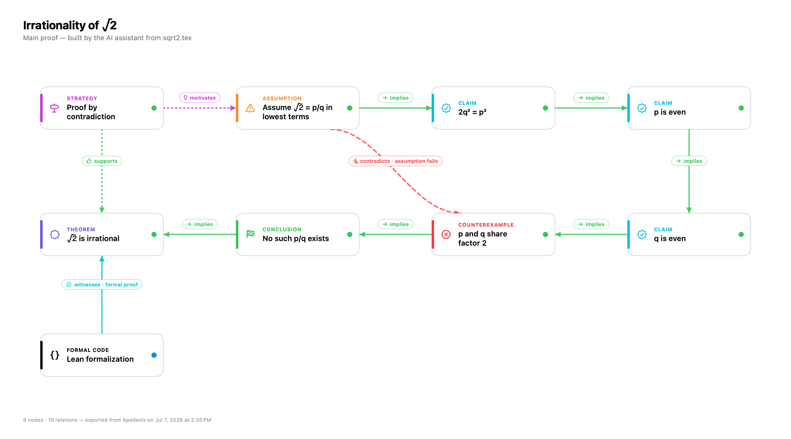

# Apodexis

Apodexis is a SwiftUI app for organizing long mathematical and scientific proof chains as typed dependency graphs rather than generic mind maps.

## Preview



The classic proof that √2 is irrational, decomposed into typed nodes and semantic relations — the same example ships in [skills/apodexis-proof-graph/examples/sqrt2-irrational](skills/apodexis-proof-graph/examples/sqrt2-irrational), ready to open with **Open Folder** or rebuild via the AI assistant.

## Targets

- `Apodexis`: native macOS app

## Download

Download the latest macOS DMG from [GitHub Releases](https://github.com/TSUITUENYUE/Apodexis/releases/latest).

Open the DMG, then drag `Apodexis.app` into `Applications`.

Release DMGs are intended to be Developer ID signed and notarized by Apple. If macOS says it cannot verify that Apodexis is free of malware, that DMG was built without notarization. Download a newer notarized release, or build from source locally.

## Implemented MVP

- Typed proof nodes: theorem, conjecture, definition, assumption, lemma, claim, proposal, strategy, conclusion, goal, reduction, case split, induction step, construction, counterexample, failed attempt, formal code.
- Semantic edges: uses, implies, reduces to, equivalent to, case of, generalizes, contradicts, depends on assumption, forks from, refines, supports, requires, motivates, blocks, diagnoses, witnesses, constrains, summarizes.
- Branch/fork workflow for alternative proof strategies.
- Multi-project workspace with folder-backed projects, a file explorer, and a proof explorer for main branches, forks, attempts, and their nodes.
- Structured node inspector with statement, context, assumptions, proof sketch, formal code, subgoals, symbols, and relations.
- Lean/Coq/Isabelle/LaTeX-oriented formal hole detection for tokens such as `sorry`, `admit`, `Admitted`, `oops`, and `TODO`.
- Native LaTeX math rendering: single equations are typeset in true 2D (stacked fractions, roots, big operators) with [SwiftMath](https://github.com/mgriebling/SwiftMath), vendored as a local package under `ThirdParty/SwiftMath`; inline math inside prose falls back to a fast Unicode renderer.
- Open goal tracker.
- Draggable graph canvas with compact node chips that expand into a full-page reader, drag-to-connect handles, double-click-to-add, node search (⌘F), undo/redo, branch centering, and a branch-local auto-layout pass.
- Local per-project JSON persistence, either in an app-managed project folder or in an opened external folder.
- Optional node source links via `sourceFile` and `sourceLine`, intended for Lean and other formalization files.
- Markdown export and clipboard copy, plus PDF export: the full proof graph (chips, connection curves, relation labels) from the canvas, and single nodes (typeset math included) from the node page.
- Human-editable JSON import via the `Import JSON` toolbar button.

## Project Folders

Apodexis treats a project as a folder, similar to a lightweight VS Code workspace.

- `Open Folder` opens an existing directory.
- The proof graph is stored in `apodexis.json` inside that folder.
- If no graph JSON exists, Apodexis creates a blank `apodexis.json`.
- If `apodexis.json` is missing, Apodexis also tries top-level JSON files such as `proof-chain.json`, `project.json`, and `workspace.json`.
- The sidebar file explorer shows common proof and research files such as `.lean`, `.md`, `.tex`, `.json`, `.toml`, `.yaml`, `.py`, `.v`, and `.thy`.

Nodes may include:

```json
{
  "sourceFile": "Proof/Main.lean",
  "sourceLine": 12
}
```

When a node has a source file, the graph card and inspector expose an open-file action.

## Import Template

Use [Templates/apodexis-import-template.json](Templates/apodexis-import-template.json) as the starting point.

The import format is intentionally simpler than the internal stored JSON. You can use string IDs such as `main-theorem`; the app converts them to internal UUIDs during import.

Important enum values:

- `type`: `theorem`, `conjecture`, `definition`, `assumption`, `lemma`, `claim`, `proposal`, `strategy`, `conclusion`, `goal`, `reduction`, `caseSplit`, `inductionStep`, `construction`, `counterexample`, `failedAttempt`, `formalCode`
- edge `type`: `uses`, `implies`, `reducesTo`, `equivalentTo`, `caseOf`, `generalizes`, `contradicts`, `dependsOnAssumption`, `forksFrom`, `refines`, `supports`, `requires`, `motivates`, `blocks`, `diagnoses`, `witnesses`, `constrains`, `summarizes`
- node `status`: `open`, `inProgress`, `blocked`, `needsReview`, `proven`, `failed`, `abandoned`
- branch `status`: `active`, `blocked`, `stuck`, `abandoned`, `merged`
- `formalDialect`: `latex`, `lean`, `coq`, `isabelle`, `pseudocode`, `swift`, `python`
- `verification`: `unchecked`, `checked`, `partial`, `checking`, `verified`, `failed`

## AI-native workflow

Building a large graph by hand is slow. The faster path is to let an AI agent
convert a proof you already have — LaTeX, a paper, rough notes, even a photo of
handwritten work — into an Apodexis graph. There are three ways to do it:

1. **In-app assistant** — the **Assistant** button (⌘⇧I) opens a chat panel inside
   Apodexis. Paste LaTeX or describe a proof and it builds/edits the open graph
   live via tool calls; every AI edit is one undo step (⌘Z). Choose your provider —
   **Claude** (Anthropic) or **OpenAI** (GPT-5.x) — and paste that provider's API
   key once (stored per-provider in the macOS Keychain).
2. **MCP server** — [integrations/mcp/](integrations/mcp/) lets Claude Desktop/Code
   build graphs into project folders through MCP tools.
3. **Skill + file** — any file-writing agent produces an `apodexis.json` you open.

Because a project is just a folder with an `apodexis.json`, and the import format
above is a stable contract, any of these can produce a graph and you open it. The
bundled skill teaches an agent how:

- **Skill:** [skills/apodexis-proof-graph/SKILL.md](skills/apodexis-proof-graph/SKILL.md) — decomposition methodology (which node/edge types to use), the output cheat-sheet, and a mandatory validation step.
- **Contract:** [skills/apodexis-proof-graph/reference/format-spec.md](skills/apodexis-proof-graph/reference/format-spec.md) — every field and enum value.
- **Validator:** `python3 skills/apodexis-proof-graph/scripts/validate.py apodexis.json` — checks a file will import cleanly before you open it.
- **Example:** [skills/apodexis-proof-graph/examples/sqrt2-irrational/](skills/apodexis-proof-graph/examples/sqrt2-irrational/) — a validated graph of the classic √2 proof. Open the folder in Apodexis to see it.

Agent-authored graphs omit hand-placed coordinates, and Apodexis **auto-arranges**
any positionless graph when it opens. See [Docs/ai-native-workflow.md](Docs/ai-native-workflow.md) for the end-to-end flow.

## Build

```sh
xcodebuild -project Apodexis.xcodeproj -scheme Apodexis -configuration Debug -destination 'platform=macOS' CODE_SIGNING_ALLOWED=NO build
```

## Package

Create a local macOS DMG installer:

```sh
Scripts/package_macos.sh
```

The output is written to `dist/`.

Local packages are ad-hoc signed by default. They are useful for testing, but downloaded copies will trigger Gatekeeper because they are not notarized.

## Release

GitHub Actions builds and publishes a notarized DMG when a version tag is pushed:

```sh
git tag v0.1.0
git push origin v0.1.0
```

The workflow uploads the generated DMG and SHA-256 checksum to the matching GitHub Release.

Tagged releases require these GitHub repository secrets:

- `APPLE_CERTIFICATE_BASE64`: base64-encoded exported `.p12` Developer ID Application certificate.
- `APPLE_CERTIFICATE_PASSWORD`: password for that `.p12` file.
- `KEYCHAIN_PASSWORD`: temporary CI keychain password.
- `APPLE_ID`: Apple ID email used for notarization.
- `APPLE_TEAM_ID`: Apple Developer Team ID.
- `APPLE_APP_SPECIFIC_PASSWORD`: app-specific password for notarization.

Create the certificate secret with:

```sh
base64 -i DeveloperIDApplication.p12 | pbcopy
```

## License

Apodexis is released under the [MIT License](LICENSE).

It bundles the following third-party components, which retain their own licenses:

- [SwiftMath](https://github.com/mgriebling/SwiftMath) (math rendering) — MIT, vendored under [`ThirdParty/SwiftMath`](ThirdParty/SwiftMath/LICENSE).
- The [Latin Modern Math](https://www.gust.org.pl/projects/e-foundry/lm-math) font used for equation rendering — [GUST Font License](ThirdParty/SwiftMath/Sources/SwiftMath/mathFonts.bundle/GUST-FONT-LICENSE.txt).
