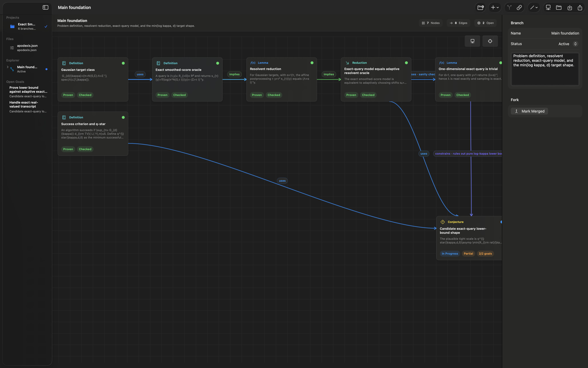

# Apodexis

Apodexis is a SwiftUI app for organizing long mathematical and scientific proof chains as typed dependency graphs rather than generic mind maps.

## Preview



## Targets

- `Apodexis`: native macOS app

## Implemented MVP

- Typed proof nodes: theorem, conjecture, definition, assumption, lemma, claim, proposal, strategy, conclusion, goal, reduction, case split, induction step, construction, counterexample, failed attempt, formal code.
- Semantic edges: uses, implies, reduces to, equivalent to, case of, generalizes, contradicts, depends on assumption, forks from, refines, supports, requires, motivates, blocks, diagnoses, witnesses, constrains, summarizes.
- Branch/fork workflow for alternative proof strategies.
- Multi-project workspace with folder-backed projects, a file explorer, and a proof explorer for main branches, forks, attempts, and their nodes.
- Structured node inspector with statement, context, assumptions, proof sketch, formal code, subgoals, symbols, and relations.
- Lean/Coq/Isabelle/LaTeX-oriented formal hole detection for tokens such as `sorry`, `admit`, `Admitted`, `oops`, and `TODO`.
- Lightweight LaTeX display rendering for common mathematical symbols, Greek letters, relations, fractions, and simple super/subscripts.
- Open goal tracker.
- Draggable graph canvas with stable drag behavior, inline node editing, quick status chips, branch centering, and a branch-local auto-layout pass.
- Local per-project JSON persistence, either in an app-managed project folder or in an opened external folder.
- Optional node source links via `sourceFile` and `sourceLine`, intended for Lean and other formalization files.
- Markdown export and clipboard copy.
- Human-editable JSON import via the `Import JSON` toolbar button.

## Project Folders

Apodexis treats a project as a folder, similar to a lightweight VS Code workspace.

- `Open Folder` opens an existing directory.
- The proof graph is stored in `apodexis.json` inside that folder.
- If no graph JSON exists, Apodexis creates a blank `apodexis.json`.
- If `apodexis.json` is missing, Apodexis also tries top-level JSON files such as `proof-chain.json`, `project.json`, and `workspace.json`.
- The sidebar file explorer shows common proof and research files such as `.lean`, `.md`, `.tex`, `.json`, `.toml`, `.yaml`, `.py`, `.v`, and `.thy`.

Nodes may include:

```json
{
  "sourceFile": "Proof/Main.lean",
  "sourceLine": 12
}
```

When a node has a source file, the graph card and inspector expose an open-file action.

## Import Template

Use [Templates/apodexis-import-template.json](Templates/apodexis-import-template.json) as the starting point.

The import format is intentionally simpler than the internal stored JSON. You can use string IDs such as `main-theorem`; the app converts them to internal UUIDs during import.

Important enum values:

- `type`: `theorem`, `conjecture`, `definition`, `assumption`, `lemma`, `claim`, `proposal`, `strategy`, `conclusion`, `goal`, `reduction`, `caseSplit`, `inductionStep`, `construction`, `counterexample`, `failedAttempt`, `formalCode`
- edge `type`: `uses`, `implies`, `reducesTo`, `equivalentTo`, `caseOf`, `generalizes`, `contradicts`, `dependsOnAssumption`, `forksFrom`, `refines`, `supports`, `requires`, `motivates`, `blocks`, `diagnoses`, `witnesses`, `constrains`, `summarizes`
- node `status`: `open`, `inProgress`, `blocked`, `needsReview`, `proven`, `failed`, `abandoned`
- branch `status`: `active`, `blocked`, `stuck`, `abandoned`, `merged`
- `formalDialect`: `latex`, `lean`, `coq`, `isabelle`, `pseudocode`, `swift`, `python`
- `verification`: `unchecked`, `checked`, `partial`, `checking`, `verified`, `failed`

## Build

```sh
xcodebuild -project Apodexis.xcodeproj -scheme Apodexis -configuration Debug -destination 'platform=macOS' CODE_SIGNING_ALLOWED=NO build
```
